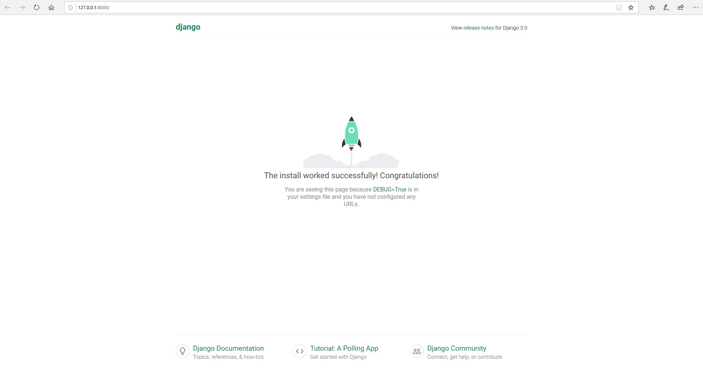

# Django_Project
Create first project
1. > pip install virtualenv
2. > virtualenv venv
3. > venv\scripts\activate
4. > pip install django
5. Verify version: 
    > py -m django --version
6. Create project
    > django-admin startproject innovationHub
7. Test the app
> py manage.py runserver                     

